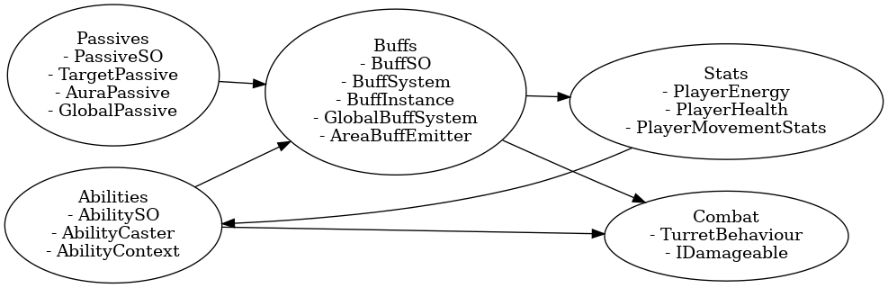
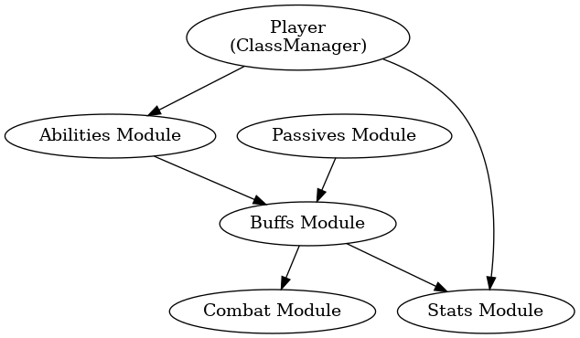

Diagrams




Ниже — **чёткое, структурированное описание всей твоей системы классов**, основанное на *фактической структуре из assets-tree.json* и на том, что мы уже построили: **Ability, Combat, Buffs, Passives, Stats**.

---

# 🧩 **Описание системы классов проекта**

*(Abilities + Combat + Buffs + Passives + Stats)*

Система классов в проекте построена по принципу **полного разделения логики** на пять независимых, но связанных подсистем:

1. **Abilities — активные способности**
2. **Combat — боевая система (урон, турели, устройства)**
3. **Buffs — система баффов (Target / Area / Global)**
4. **Passives — пассивные способности, автоматически создающие баффы**
5. **Stats — характеристика игрока: энергия, параметры, регенерация**

Все пять модулей независимы, но взаимодействуют через **общие точки расширения**:
`BuffSystem`, `AbilityContext`, `IBuffTarget`, `IDamageable`.

---

# 1️⃣ **Abilities — активные способности**

## 📌 Где лежат

`Assets/Features/Abilities/`

## 📌 Что делают

Каждая способность — это ScriptableObject (`AbilitySO`).
Игрок активирует способность → AbilityCaster передаёт контекст → создаётся эффект (турель, дрон, перегрузка, щит...).

## 📌 Состав модуля

* **Core**

  * `AbilitySO` — базовый класс всех способностей
  * `AbilityCaster` — вызывает способности
  * `AbilityContext` — передаёт `owner`, позицию, направление
* **Types**

  * `ChargeDeviceAbilitySO`
  * `DeployTurretAbilitySO`
  * `OverloadPulseAbilitySO`
  * `RepairDroneAbilitySO`
  * `ShieldGridAbilitySO`

## 📌 Особенности архитектуры

* Способности **не модифицируют статы напрямую**
  Они создают игровые объекты (турели, дроны, зарядники), которые уже обрабатываются системой Buffs/Combat/Stats.

* Все способности работают одинаково:

  1. проверка энергии
  2. исполнение
  3. запуск кулдауна
  4. обновление UI
  5. взаимодействие с BuffSystem опционально

---

# 2️⃣ **Combat — система боя и устройств**

## 📌 Где лежит

`Assets/Features/Combat/`

## 📌 Основной объект

**TurretBehaviour** — твоя полноценная автономная единица боя.

## 📌 Компоненты:

* Наведение (`RotateToTarget`)
* Поиск врагов (`AcquireTarget`)
* Урон (`FireIfPossible`)
* Лазер (`LineRenderer`)
* Время жизни (`LifeTimer`)
* Принятие баффов (`IBuffTarget` + BuffSystem)

## 📌 Особенности

* Турель не хранит баффы сама → ею управляет `BuffSystem`.
* На каждый кадр она пересчитывает:

  * множители урона
  * множитель скорости стрельбы
  * множитель скорости поворота

Это делает турель детерминированной и легко модифицируемой через баффы/пассивки.

---

# 3️⃣ **Buffs — полноценная система баффов**

## 📌 Где лежит

`Assets/Features/Buffs/`

## 📌 Главные компоненты

### ✔ **BuffSystem (на объекте)**

Хранит список активных баффов (`BuffInstance`).
Умеет:

* добавлять
* продлевать
* удалять
* вызывать OnApply / OnExpire у баффов

### ✔ **BuffSO**

Базовый ScriptableObject баффа.

Типы баффов:

### **1. Target Buffs**

Применяются к одному объекту через `BuffSystem.AddBuff()`.

Примеры:

* `DamageBuffSO`
* `FireRateBuffSO`
* `RotationSpeedBuffSO`

Используются турелью, дронами, игроком.

---

### **2. Area Buffs**

Вокруг источника создаётся `AreaBuffEmitter`.
Он каждые 0.1–0.2 сек проверяет кто внутри радиуса → применяет бафф → удаляет при выходе.

Это основа твоих пассивок типа *Energy Efficiency*.

---

### **3. Global Buffs**

Хранятся в `GlobalBuffSystem`.

Структура глобального баффа:

```
key = "turret_hp"
value = +15%
```

Глобальные баффы не знают о конкретных объектах → любой объект может запросить:

```
var hpBonus = GlobalBuffSystem.I.GetValue("turret_hp");
```

Используется для:

* усиления турелей
* глобального бонуса регена
* снижения стоимости способностей
* технологических пассивок

---

# 4️⃣ **Passives — пассивные способности**

## 📌 Где лежат

`Assets/Features/Abilities/Passives/`

## 📌 Что делают

Пассивки — это *триггеры*, включающие баффы.

Типы пассивок:

### **1. TargetPassiveBuffSO**

Применяет бафф прямиком в `BuffSystem` владельца.

Например:
*Extra Capacity* → +MaxEnergy

---

### **2. AuraPassiveBuffSO**

Создаёт `AreaBuffEmitter` вокруг игрока.

Например:
*Energy Efficiency* → регенерация союзников → областьный бафф.

---

### **3. GlobalPassiveBuffSO**

Просто добавляет глобальный бафф по ключу.

Например:
*Reinforced Constructions* → `"turret_hp" = +15%`

---

### ✔ Итог

Пассивки — это просто фабрики баффов.
Они **ничего не делают сами**,
всё делает BuffSystem.

---

# 5️⃣ **Stats — система характеристик игрока**

## 📌 Где лежит

`Assets/Features/Player/Scripts/Stats/`

Главный класс: **PlayerEnergy**

## Что делает

* хранит энергию
* считает максимальную энергию
* считает регенерацию
* применяет баффы на MaxEnergy и Regen
* вызывает UI обновление

## 📌 Как взаимодействует с баффами

### ➤ Локальные баффы (Target Buff)

Через BuffSystem:
`MaxEnergyBuffSO`
`EnergyRegenBuffSO`

### ➤ Глобальные баффы

Например `global_key = "energy_regen"`.

Суммируются в `Regen` и `MaxEnergy`.

---

# 🧩 Связи между системами

| Подсистема    | Зависит от                   | Использует                 |
| ------------- | ---------------------------- | -------------------------- |
| **Abilities** | PlayerEnergy                 | Combat, Buffs              |
| **Combat**    | BuffSystem, GlobalBuffSystem | IDamageable                |
| **Buffs**     | нет                          | Passives, Combat, Stats    |
| **Passives**  | Buffs                        | Area, Target, Global баффы |
| **Stats**     | BuffSystem, GlobalBuffSystem | UI                         |

---

# 🧠 Ключевая идея архитектуры

> **Все изменения статистик проходят только через Buffs и GlobalBuffSystem.
> Способности и пассивки — это просто генераторы баффов.
> Combat — потребитель.**
